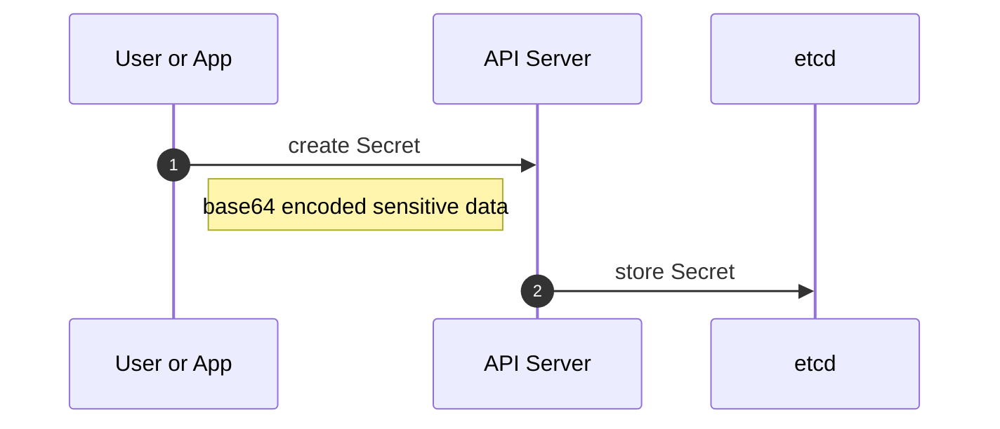
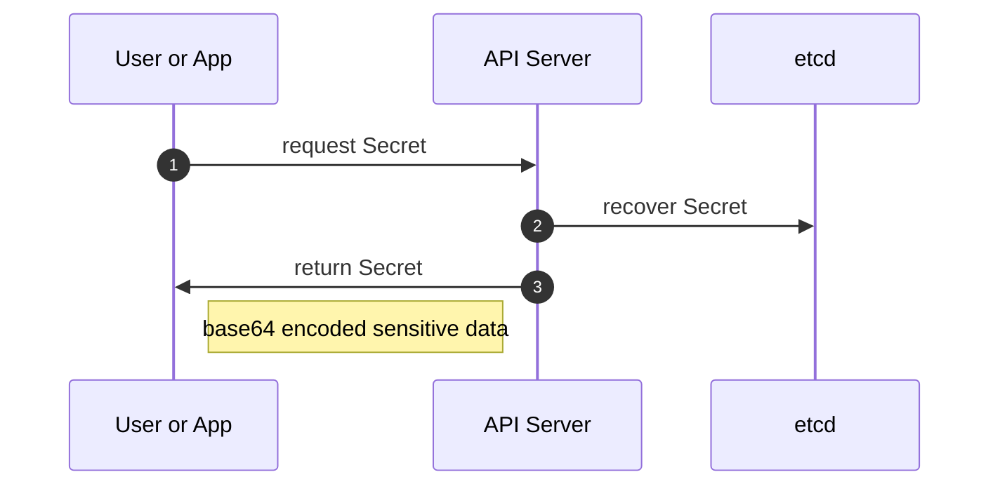
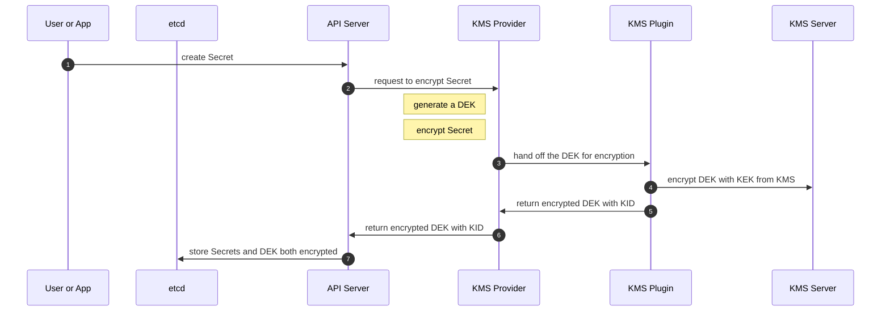
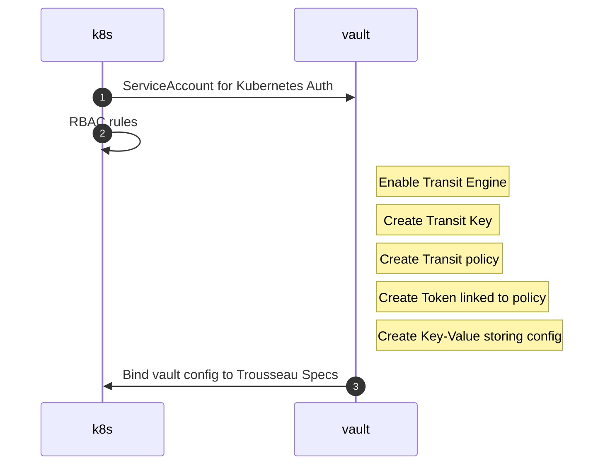
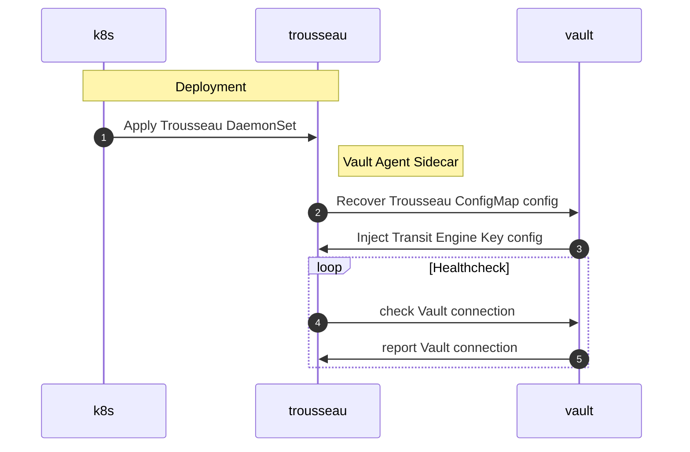
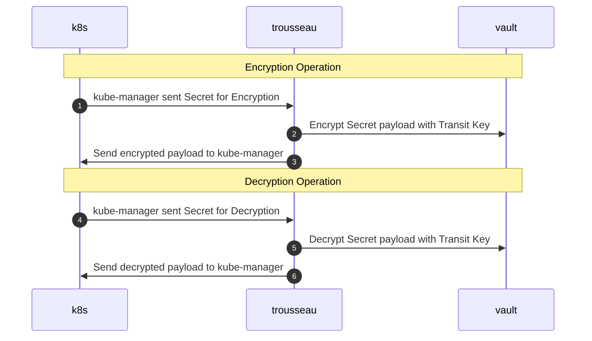
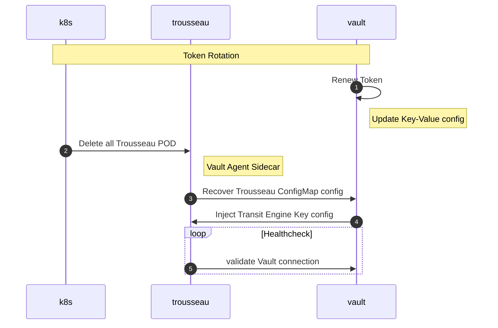

# Kubernetes Secrets Management

## Treat Modeling 

                                          
| Methode                                    | Disk | RAM | etcd | API Server | KMS Server |
|--------------------------------------------|------|-----|------|------------|------------| 
| Native                                     | :material-close: | :material-close: | :material-close: | :material-close: | :material-close: |
| File System Encryption                     | :material-check: | :material-close: | :material-close: | :material-close: | :material-close: |
| [External Secrets Operator](https://external-secrets.io/) | :material-close: | :material-close: | :material-close: | :material-close: | :material-check: [1] |
| [SOPS](https://github.com/mozilla/sops)    | :material-close: | :material-close: | :material-close: | :material-close: | :material-check: [2] |
| KMS Provider Encryption at rest            | :material-close: | :material-close: | :material-check: | :material-close: | :material-close: |
| KMS Provider with Plugin for external KMS  | :material-check: | :material-check: [3] | :material-check: | :heavy_check_mark: [4] | :material-check: [5] |

## Native Kubernetes Default Behavior

Kubernetes is using a distributed key-value data store to record all API Objects definition along with their state and version. To ensure proper processing, data is encoded in base64 removing challenges with special characters.  

Same concept applies to Secret, especially leveraging special characters for extra security, for example:

``` title="secret.yml"
--8<-- "trousseau/files/secret.yml"
```

The above base64 encoded values are ```admin``` and ```p@ssw0rd$```. When creating the Secret with ```kubectl apply -f mysecret.yml```, the following flow will be triggered: 



When reading the Secret with ```kubectl get -n myapp secrets/mysecret -o yaml```, the following flow will be triggered:  



### Threat assessment 
Zero protection leading to full exposure of Secrets from file system, etcd data store, and Kubernetes API.


## 


## Kubernetes KMS Provider with external KMS

The Kubernetes API Server can encrypt the sensitve data from Secrets using the KMS Provider. In this scenario, an external KMS is used to encrypt in-flight the Data Encryption Key using to encrypt the sensitive data. This process is called an encryption envelop scheme.   

When creating the Secret with ```kubectl apply -f mysecret.yml```, the following flow will be triggered: 



### Threat assessment 
This approach mitigates:

- attacker accessing the file system as root
- attacker accessing the etcd data store (etcd being compromised)
- attacker accessing the API Server still requires the KEK hosted on the remote KMS 
- offline copy of etcd data store requires KEK for decryption of DEKs to decrypt Secrets

This approach does not mitigate:

- attacker accessing the API Server memory allocation can read DEKs recently cached

## Trousseau Deployment Workflow 

### Kubernetes & Vault Configuration


### Trousseau Deployment 


### Trousseau Operations


### Vault Token Renewal

