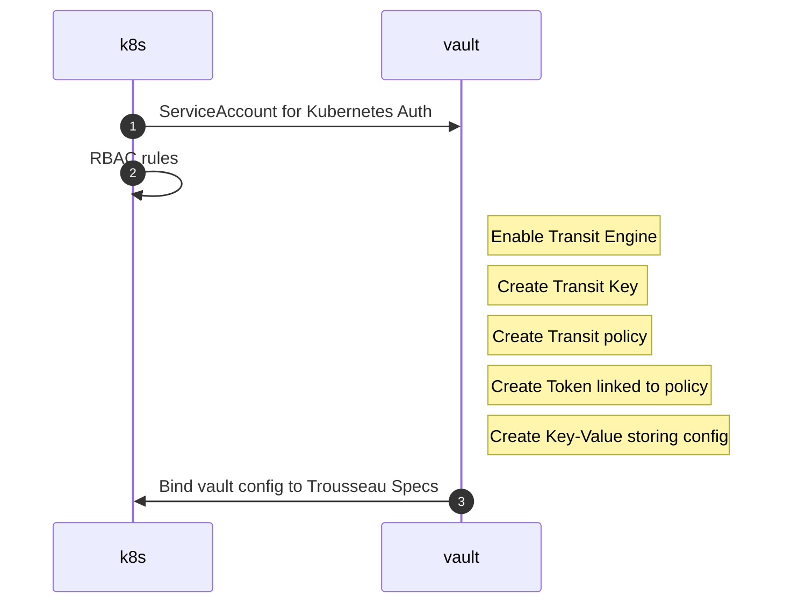
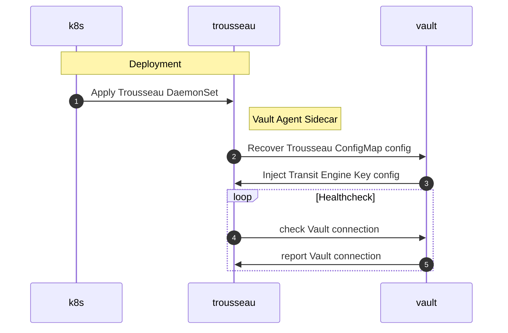
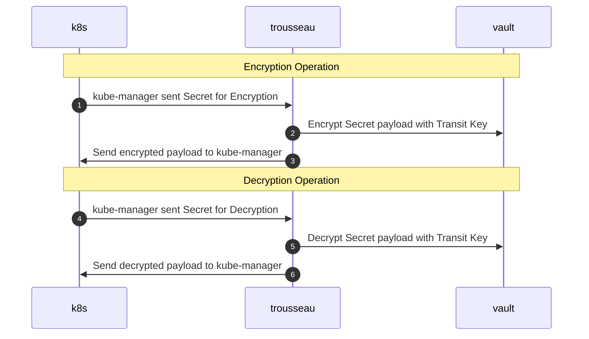
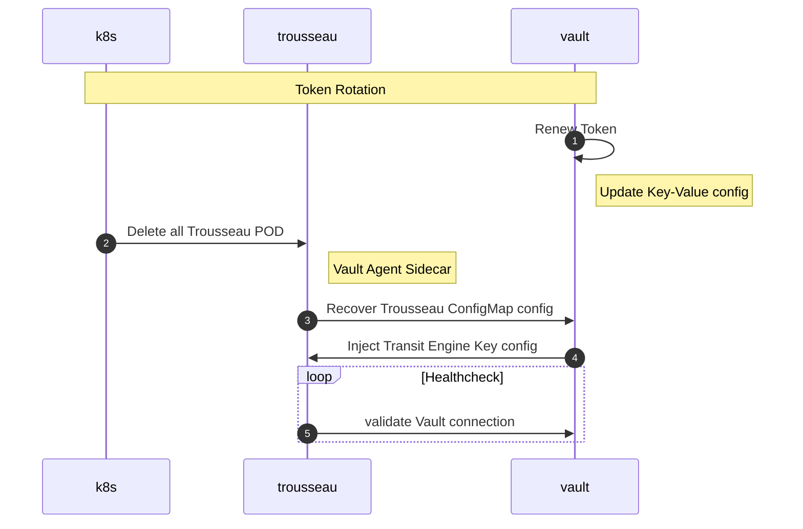

## Trousseau Deployment Workflow 

### Kubernetes & Vault Configuration

```mermaid
sequenceDiagram
participant k8s
participant vault
autonumber
  k8s->>vault: ServiceAccount for Kubernetes Auth
  k8s->>k8s: RBAC rules
  Note right of vault: Enable Transit Engine
  Note right of vault: Create Transit Key
  Note right of vault: Create Transit policy
  Note right of vault: Create Token linked to policy
  Note right of vault: Create Key-Value storing config
  vault->>k8s: Bind vault config to Trousseau Specs
```

### Trousseau Deployment 

```mermaid
sequenceDiagram
participant k8s
participant trousseau
participant vault
autonumber
  Note over k8s,trousseau: Deployment
  k8s->>trousseau: Apply Trousseau DaemonSet
  Note right of trousseau: Vault Agent Sidecar
  trousseau->>vault: Recover Trousseau ConfigMap config
  vault->>trousseau: Inject Transit Engine Key config
  loop Healthcheck
      trousseau->>vault: check Vault connection
      vault->>trousseau: report Vault connection
  end
```

### Trousseau Operations

```mermaid
sequenceDiagram
participant k8s
participant trousseau
participant vault
autonumber
  Note over k8s,vault: Encryption Operation
  k8s->>trousseau: kube-manager sent Secret for Encryption
  trousseau->>vault: Encrypt Secret payload with Transit Key
  trousseau->>k8s: Send encrypted payload to kube-manager
  Note over k8s,vault: Decryption Operation
  k8s->>trousseau: kube-manager sent Secret for Decryption
  trousseau->>vault: Decrypt Secret payload with Transit Key
  trousseau->>k8s: Send decrypted payload to kube-manager
```

### Vault Token Renewal

```mermaid
sequenceDiagram
participant k8s
participant trousseau
participant vault
autonumber
  Note over k8s,vault: Token Rotation
  vault->>vault: Renew Token
  Note right of vault: Update Key-Value config
  k8s->>trousseau: Delete all Trousseau POD
  Note right of trousseau: Vault Agent Sidecar
  trousseau->>vault: Recover Trousseau ConfigMap config
  vault->>trousseau: Inject Transit Engine Key config
  loop Healthcheck
      trousseau->>vault: validate Vault connection
  end
```
