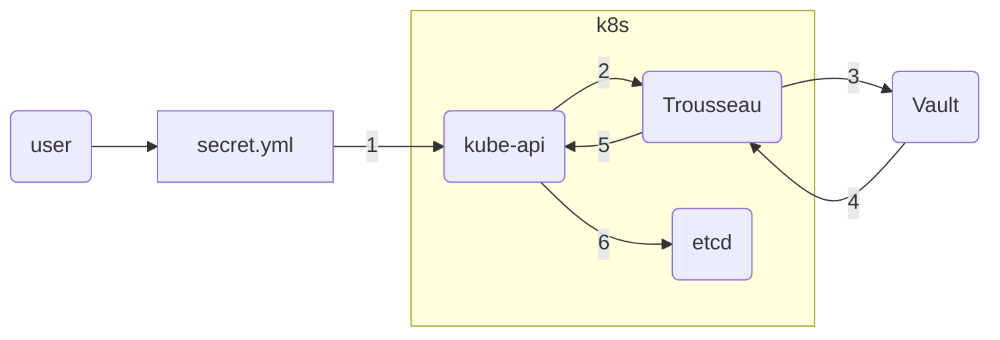
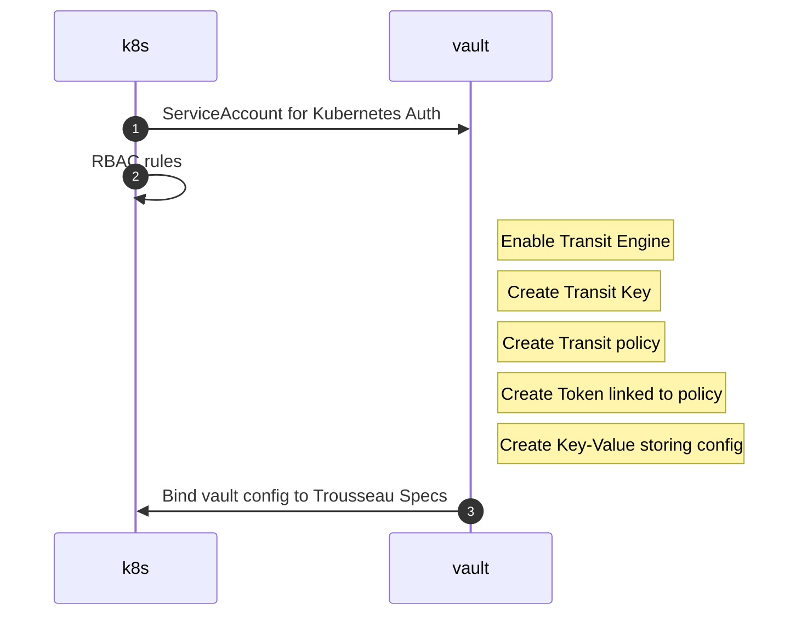
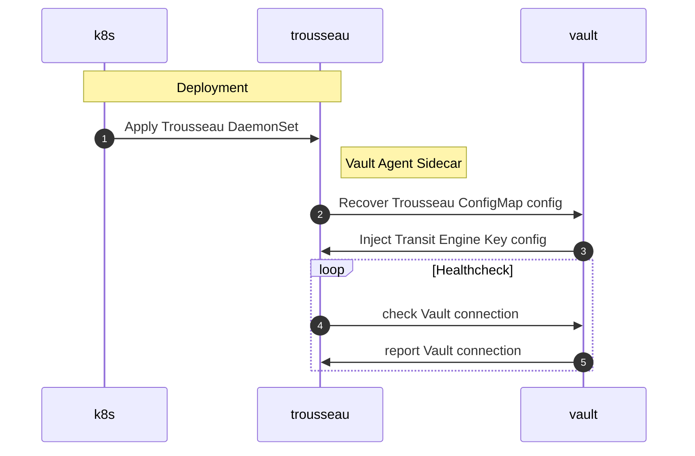
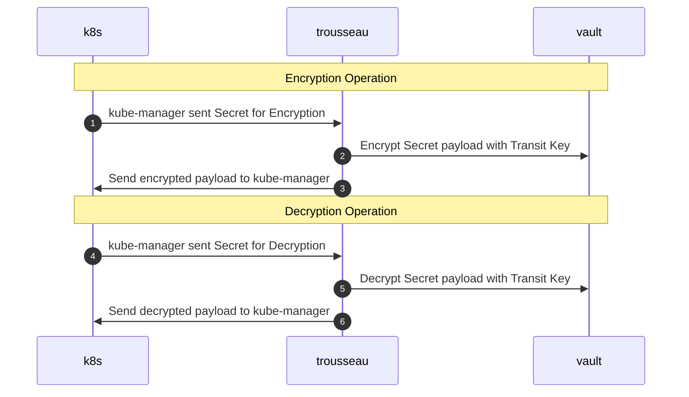
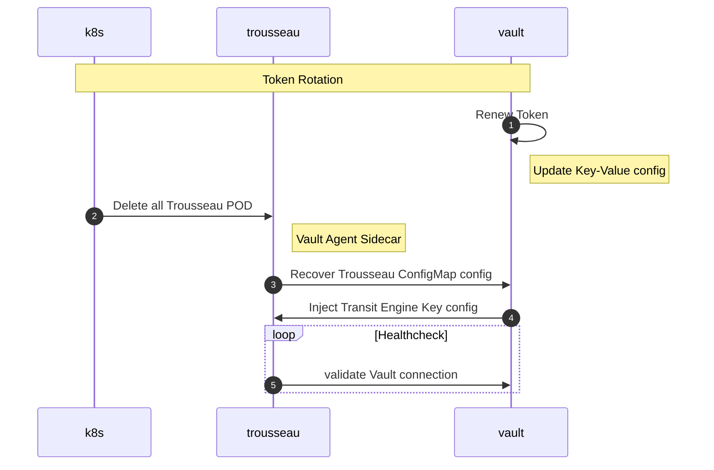

### Terminology & Concepts
#### What is a Kubernetes Secrets

!!! info "Extract from [kubernetes.io](https://kubernetes.io/docs/concepts/configuration/secret/)"
    A Secret is an object that contains a small amount of sensitive data such as a password, a token, or a key. Such information might otherwise be put in a Pod specification or in a container image. Using a Secret means that you don't need to include confidential data in your application code.

    Because Secrets can be created independently of the Pods that use them, there is less risk of the Secret (and its data) being exposed during the workflow of creating, viewing, and editing Pods. Kubernetes, and applications that run in your cluster, can also take additional precautions with Secrets, such as avoiding writing confidential data to nonvolatile storage.

    Secrets are similar to ConfigMaps but are specifically intended to hold confidential data.

#### Why are Kubernetes Secrets not secure?
From a configuration file perspective, the sensitive data is encoded in base64. The base64 encoding allows to pass a string cleared of special characters that could break during the deployment and should not be considered as encryption as anyone can decode the payload. 

!!! info "Extract from [kubernetes.io](https://kubernetes.io/docs/concepts/configuration/secret/)"
    Kubernetes Secrets are, by default, stored unencrypted in the API server's underlying data store (etcd). Anyone with API access can retrieve or modify a Secret, and so can anyone with access to etcd. Additionally, anyone who is authorized to create a Pod in a namespace can use that access to read any Secret in that namespace; this includes indirect access such as the ability to create a Deployment.

    In order to safely use Secrets, take at least the following steps:

    1. Enable Encryption at Rest for Secrets.
    2. Enable or configure RBAC rules that restrict reading data in Secrets (including via indirect means).
    3. Where appropriate, also use mechanisms such as RBAC to limit which principals are allowed to create new Secrets or replace existing ones.

#### KMS or Key Management Service
!!! info "Extract of [wikipedia.org](https://en.wikipedia.org/wiki/Key_management)"
    Key management refers to management of cryptographic keys in a cryptosystem. This includes dealing with the generation, exchange, storage, use, crypto-shredding (destruction) and replacement of keys. It includes cryptographic protocol design, key servers, user procedures, and other relevant protocols.[1]

    Key management concerns keys at the user level, either between users or systems. This is in contrast to key scheduling, which typically refers to the internal handling of keys within the operation of a cipher.

    Successful key management is critical to the security of a cryptosystem. It is the more challenging side of cryptography in a sense that it involves aspects of social engineering such as system policy, user training, organizational and departmental interactions, and coordination between all of these elements, in contrast to pure mathematical practices that can be automated.

#### Zero trust security model
!!! info "Extract of [wikipedia.org](https://en.wikipedia.org/wiki/Zero_trust_security_model)"
    The zero trust security model (also, zero trust architecture, zero trust network architecture, ZTA, ZTNA), sometimes known as perimeterless security, describes an approach to the design and implementation of IT systems. The main concept behind the zero trust security model is "never trust, always verify,” which means that devices should not be trusted by default, even if they are connected to a permissioned network such as a corporate LAN and even if they were previously verified.   

    Most modern corporate networks consist of many interconnected zones, cloud services and infrastructure, connections to remote and mobile environments, and connections to non-conventional IT, such as IoT devices. The reasoning for zero trust is that the traditional approach — trusting devices within a notional "corporate perimeter", or devices connected via a VPN — is not relevant in the complex environment of a corporate network.  

    The zero trust approach advocates mutual authentication, including checking the identity and integrity of devices without respect to location, and providing access to applications and services based on the confidence of device identity and device health in combination with user authentication.

## Design principles
Trousseau is built against the following principles:

- zero trust security model
- develop in Golang
- respectful of Kubernetes native API and the Kubernetes KMS provider plugin framework 
- integrate with multiple KMS provider solutions

### Zero Trust security model

Starting with [version 1.1.0](https://github.com/ondat/trousseau/tree/v1.1.0), Trousseau introduced a Zero trust security model addressing 5 out 6 [key principles](https://en.wikipedia.org/wiki/Zero_trust_security_model#Principles_and_Definitions):

| Principle | Trousseau | Status |
|-----------|-----------|--------|
| single strong source of user identity | integrate with a remote KMS | :material-check-all: |
| user authentication | support separation of duties | :material-check-all: |
| machine authentication | Kubernetes ServiceAccount & KMS Kubernetes Auth method| :material-check-all: |
| additional context check, such as policy compliance and device health | [a GitHub issues](https://github.com/ondat/trousseau/issues/48)| :material-check: |
| authorization policies to access an application | KMS policy & role | :material-check-all: | 
| access control policies within an application | dedicated token recovered via ConfigMap | :material-check-all: |

### Develop in Golang
The development language has been chosen based on the ecosystem in which Kubernetes resources are developped. 

### Kubernetes native 
To provide the maximum flexibility when being integrated within an end-to-end DevOps journey, using a native Kubernetes API approach allows to reduce the next to call for custom API or run extra CLI tooling in runners.  
As an extra benefit, this will reduce the need for a DevOps team to learn new niche skills and have a clear separation of duties with the Security team. 

To support the above, Trousseau is leveraging the native [Kubernetes KMS provider](https://kubernetes.io/docs/tasks/administer-cluster/kms-provider/) framework to secure secrets with a remote KMS while still being safe locally within the Kubernetes *etcd* by acting as a KMS broker between the DevOps team, the ```kube-apiserver``` and the remote KMS. 

### KMS providers
Trousseau aims to provide support for multiple KMS providers. As per version 1.1.0 of Trousseau, the following KMS providers are supported:

| KMS Provider | Version | Status | 
|--------------|---------|--------|
| HashiCorp Vault (Community & Enterprise) | 1.x | :material-check-all: |
| HashiCorp Cloud Vault Enterprise | n/a | :material-check-all: |

## Architecture Diagram

<!--  -->



1. Create a secret
2. kube-api calls Trousseau
3. Trousseau sends the encryption request to the KMS provider
4. The KMS provider returne the encrypted data to Trousseau
5. Trousseau sends the encrypted data back to kube-api
6. kube-api stores the encrypted resource in etcd


## Workflow 

### Kubernetes & Vault Configuration


### Trousseau Deployment 


### Trousseau Operations


### Vault Token Renewal

