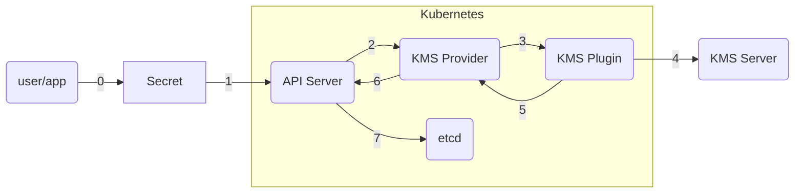
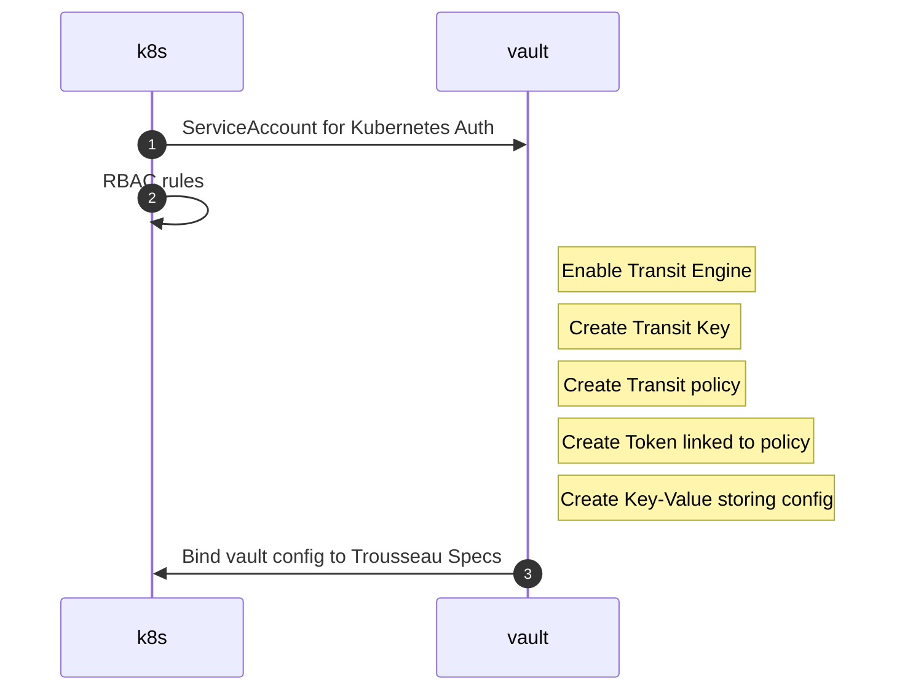
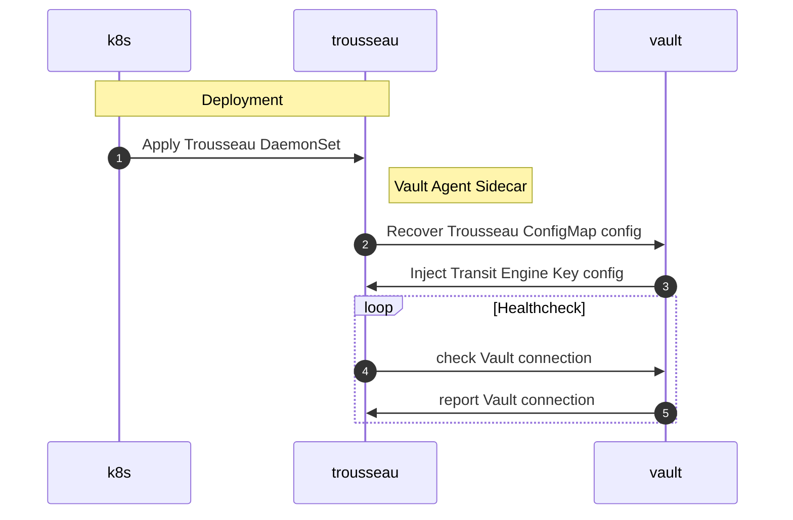
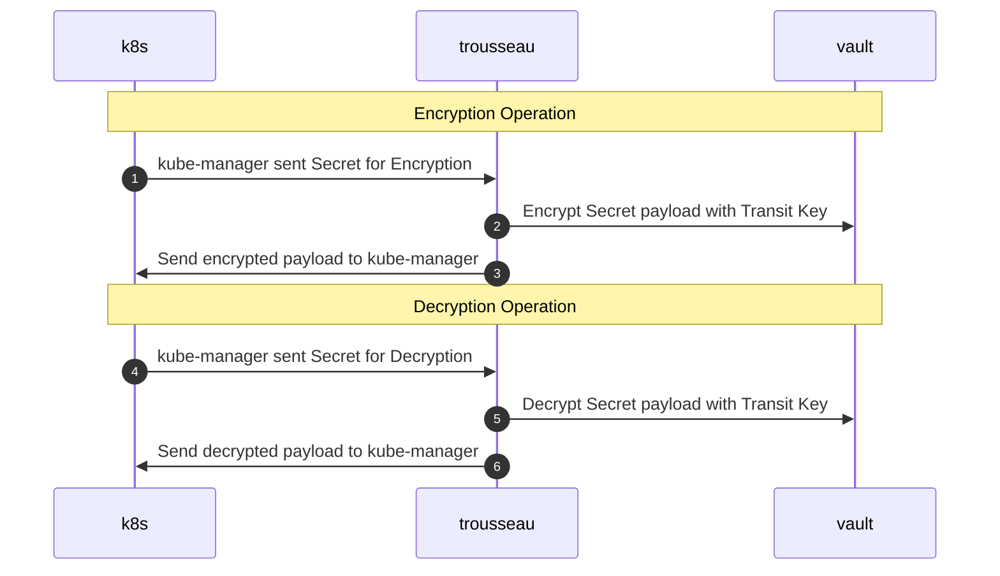
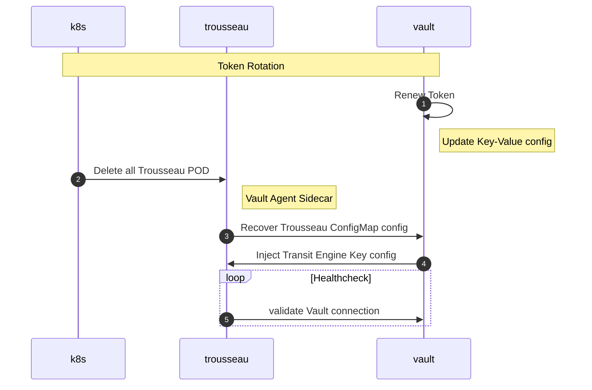

## Design principles
Trousseau is built against the following principles:

- zero trust security model
- develop in Golang
- respectful of Kubernetes native API and the Kubernetes KMS provider plugin framework 
- integrate with multiple KMS provider solutions

### Zero Trust security model

Starting with [version 1.1.0](https://github.com/ondat/trousseau/tree/v1.1.0), Trousseau introduced a Zero trust security model addressing 5 out 6 [key principles](https://en.wikipedia.org/wiki/Zero_trust_security_model#Principles_and_Definitions):

| Principle | Trousseau | Status |
|-----------|-----------|--------|
| single strong source of user identity | integrate with a remote KMS | :material-check-all: |
| user authentication | support separation of duties | :material-check-all: |
| machine authentication | Kubernetes ServiceAccount & KMS Kubernetes Auth method| :material-check-all: |
| additional context check, such as policy compliance and device health | [a GitHub issues](https://github.com/ondat/trousseau/issues/48)| :material-check: |
| authorization policies to access an application | KMS policy & role | :material-check-all: | 
| access control policies within an application | dedicated token recovered via ConfigMap | :material-check-all: |

### Develop in Golang
The development language has been chosen based on the ecosystem in which Kubernetes resources are developped. 

### Kubernetes native 
To provide the maximum flexibility when being integrated within an end-to-end DevOps journey, using a native Kubernetes API approach allows to reduce the next to call for custom API or run extra CLI tooling in runners.  
As an extra benefit, this will reduce the need for a DevOps team to learn new niche skills and have a clear separation of duties with the Security team. 

To support the above, Trousseau is leveraging the native [Kubernetes KMS provider](https://kubernetes.io/docs/tasks/administer-cluster/kms-provider/) framework to secure secrets with a remote KMS while still being safe locally within the Kubernetes *etcd* by acting as a KMS broker between the DevOps team, the ```kube-apiserver``` and the remote KMS. 

### KMS providers
Trousseau aims to provide support for multiple KMS providers. As per version 1.1.0 of Trousseau, the following KMS providers are supported:

| KMS Provider | Version | Status | 
|--------------|---------|--------|
| HashiCorp Vault (Community & Enterprise) | 1.x | :material-check-all: |
| HashiCorp Cloud Vault Enterprise | n/a | :material-check-all: |

## Kubernetes KMS Provider Plugin Overview

<!--  -->



0. An User or Application creates a Secret (a ConfigMap could also benefit)
2. The Kubernetes API Server will request the KMS Provider to encrypt the Secret.  
   The KMS Provider generates a DEK (Data Encryption Key) to encrypt the data field.
3. The KMS Provider hands off the DEK to the KMS Plugin for encryption.
4. The KMS Plugin leverage a KMS Server to encryp tthe DEK with a KEK (Key Encryption Key).
5. The KMS Plugin returns to the KMS Provider the encrypted DEK with a KID (Key ID).
6. The KMS Provider returns the encrypted DEK & KID to the API Server.
7. The API Server stores the encrypted as a Secret the encrypted data field, encrypted DEK and KID.


## Workflow 

### Kubernetes & Vault Configuration


### Trousseau Deployment 


### Trousseau Operations


### Vault Token Renewal

