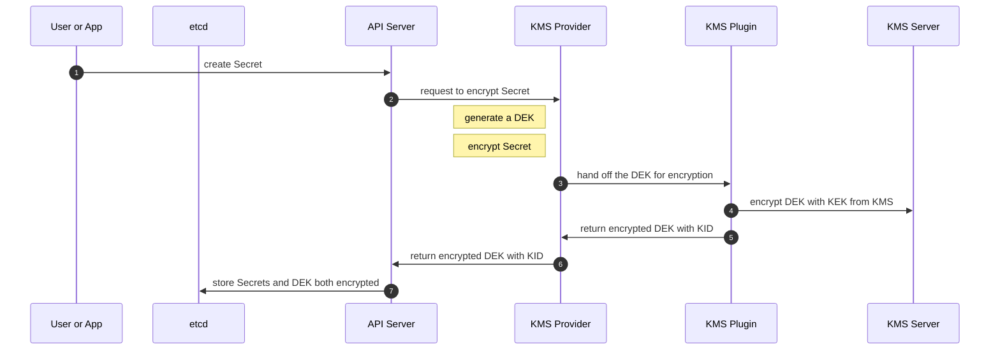
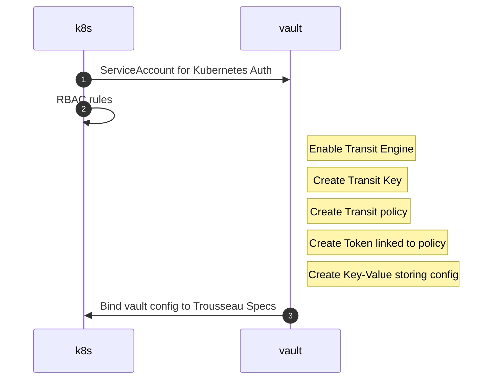
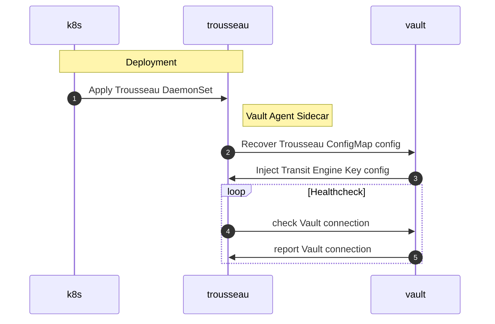
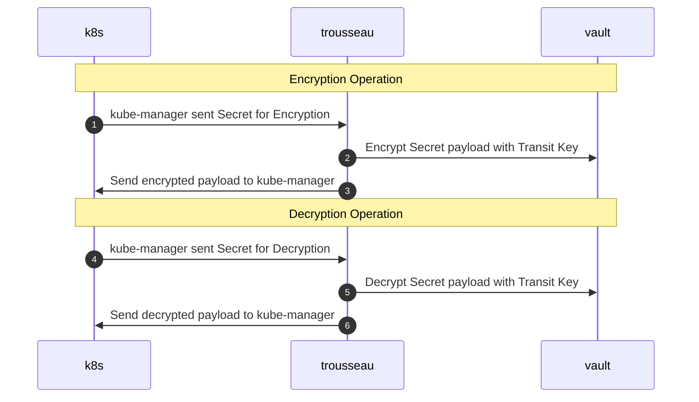
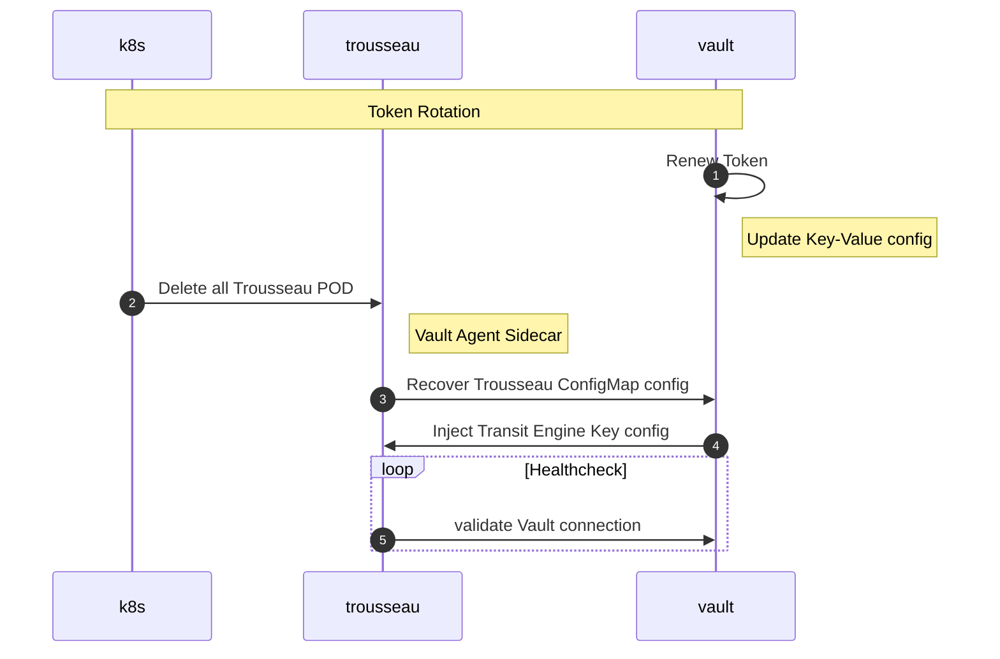

## Trousseau: KMS Provider with Plugin for external KMS

### Overview 

The Kubernetes API Server can encrypt the sensitve data from Secrets using the KMS Provider. In this scenario, an external KMS is used to encrypt in-flight the Data Encryption Key using to encrypt the sensitive data. This process is called an encryption envelop scheme. 

The Trousseau project is providing an implementation of the Plugin component allowing the interaction of the API Server KMS Provider with an external KMS Server. The current list of supported KMS Servers is available within the [release notes](trousseau/releasenotes.md).

When creating the Secret with ```kubectl apply -f mysecret.yml```, the following flow will be triggered: 



### Software Components

#### Trousseau

Trousseau deploys as a container on the Control Plane node. It will create a temporary Unix socket instantiating a gRPC server that the KMS Provider component from Kubernetes API Server will be able to communicate with.  

#### Vault Agent

Trousseau leverages a sidecar with the HashiCorp Vault Agent to recover the Transit Engine parameters. This allows to avoid direct exposure to the Encryption Transit Engine. 

#### Vault 

Trousseau requires a KMS like HashiCorp Vault to provide access to a Transit Encryption Engine for the Kubernetes KMS Provider. 

### Kubernetes Components

#### ServiceAccount

A ServiceAccount is created to using a certificate token used for a mutual authentication with the HashiCorp Vault instance. This is leverage by the sidecar to recover the Transit Engine parameters. 

#### ConfigMap

A ConfigMap is used by the HashiCorp Vault Agent sidecar to hand over the Encryption Transit Engine parameters to Trousseau. The following parameters are expected:

- the Transit Engine Endpoint
- the Transit Engine Key name
- the Transit Engine dedicated access Token 

#### DaemonSet 

Trousseau deploys as a DaemonSet to guarantee that every Control Plane node will have a running instance with its gRPC server addressing any potential partitioning that could occur during the Control Plane lifetime. 

## Trousseau Deployment Workflow 

### Kubernetes & Vault Configuration


### Trousseau Deployment 


### Trousseau Operations


### Vault Token Renewal

