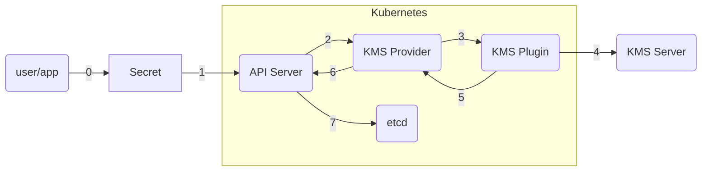
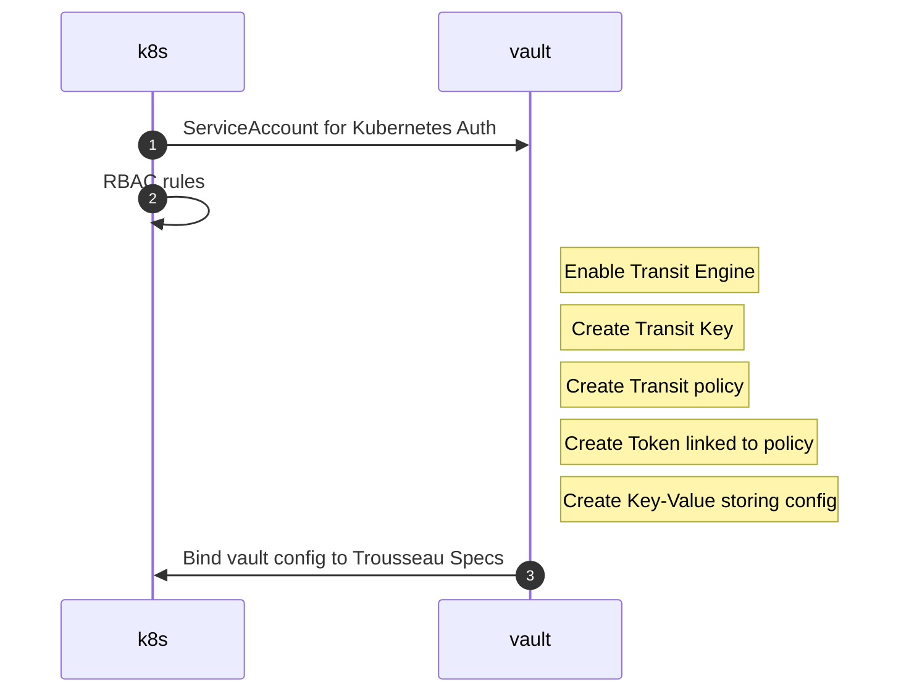
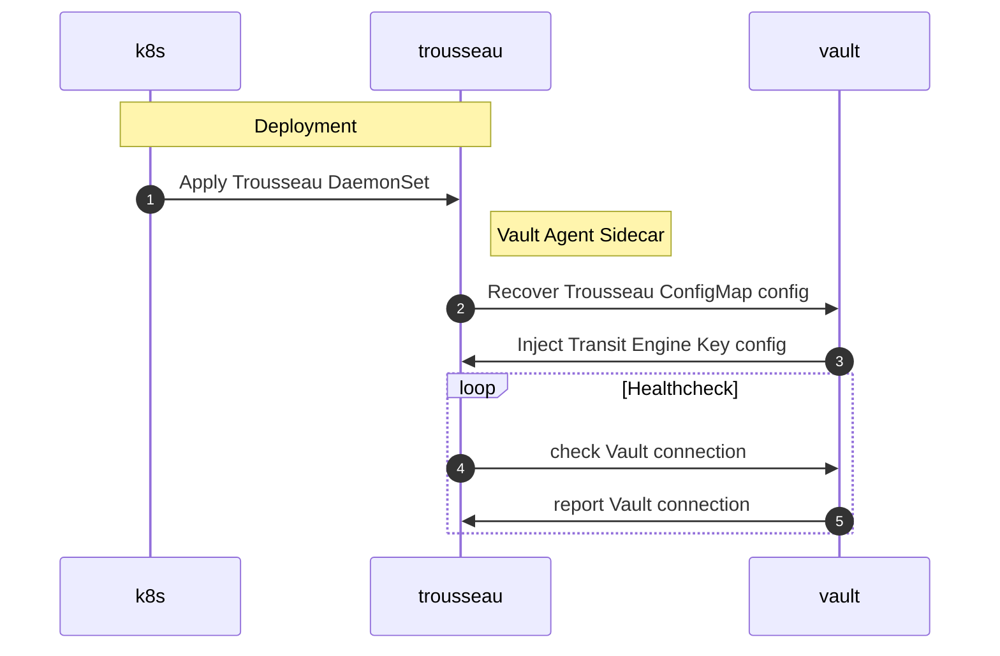
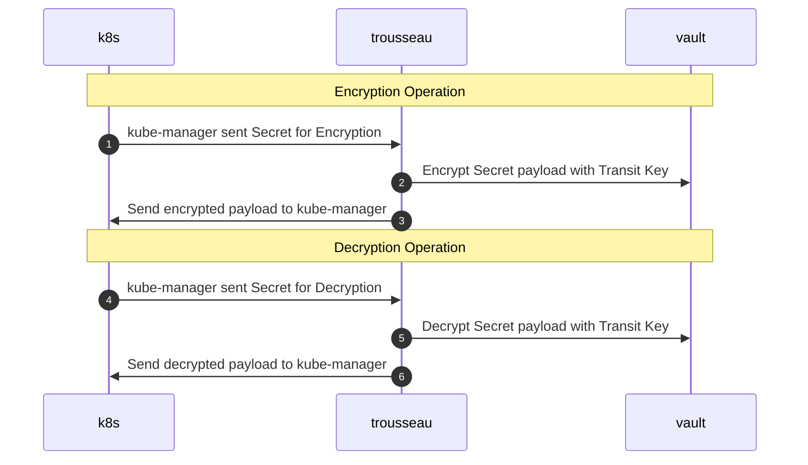
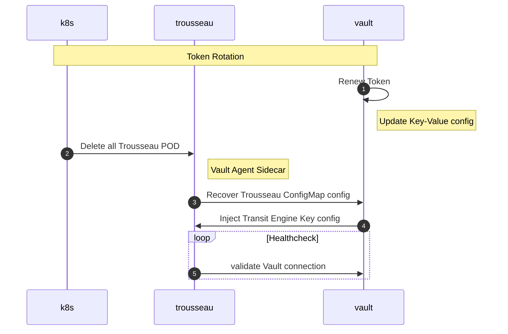

## Kubernetes KMS Provider Plugin Overview

<!--  -->

0. An User or Application creates a Secret (a ConfigMap could also benefit)
2. The Kubernetes API Server will request the KMS Provider to encrypt the Secret.  
   The KMS Provider generates a DEK (Data Encryption Key) to encrypt the data field.
3. The KMS Provider hands off the DEK to the KMS Plugin for encryption.
4. The KMS Plugin leverage a KMS Server to encryp tthe DEK with a KEK (Key Encryption Key).
5. The KMS Plugin returns to the KMS Provider the encrypted DEK with a KID (Key ID).
6. The KMS Provider returns the encrypted DEK & KID to the API Server.
7. The API Server stores the encrypted as a Secret the encrypted data field, encrypted DEK and KID.

## Workflow 

### Kubernetes & Vault Configuration

### Trousseau Deployment 

### Trousseau Operations

### Vault Token Renewal

