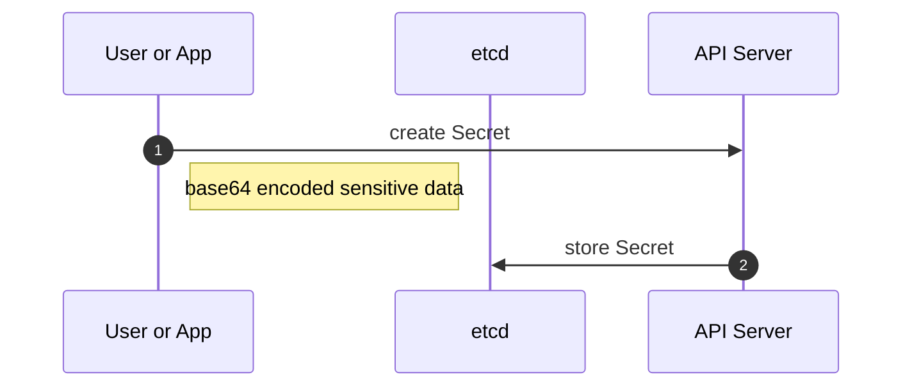
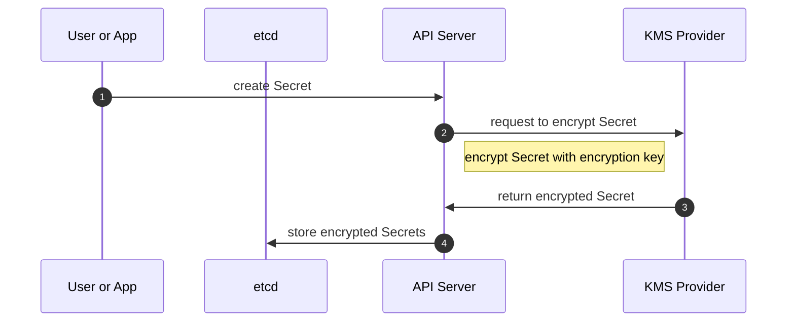
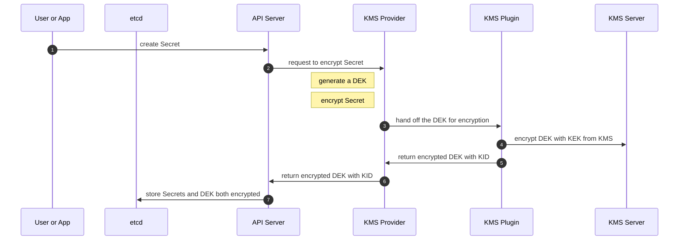

# Kubernetes Secrets Management

## Threat Modeling 

The below table is providing a holistic view of the different Secret Management implementation and their mitigations against Kubernetes internal and external components.

!!! info "Legend"  
    - :material-close: used when does not mitigate the related component
    - :material-check: used when mitigate has caveat(s)
    - :material-check-all: used when mitigation has no caveat
    - **Disk** (:material-harddisk:) ; if control plane node disk is compromised online (access to the node) or offline (access to a copy/backup)
    - **RAM** (:material-memory:) ; if the memory allocation is compromised online (via a process like the API Server) or offline (memory dump from backup)
    - **etcd** (:material-database:); if the etcd data store is compromised (access via etcdctl) or offline (access to a copy/backup)
    - **KMS server** (:material-key-chain:); if Key Management Service server is compromised 
                                          
| Implementation | :material-harddisk: | :material-memory: | :material-database: | :material-key-chain: |
|--------------------------------------------|------|-----|------|------------| 
| File System Encryption                     | :material-check-all: | :material-close: | :material-close: | :material-close: |
| Native Kubernetes Secrets                  | :material-close: | :material-close: | :material-close: | :material-close: |
| [External Secrets Operator](https://external-secrets.io/) | :material-close: | :material-close: | :material-close: | :material-close: |
| KMS Provider with Encryption at rest       | :material-close: | :material-close: | :material-check: [1] | :material-close: |
| KMS Provider with Plugin for external KMS  | :material-check-all: | :material-check: [2] | :material-check-all: | :material-check: [3] |

!!! note "Notes"
    - [1] including offline attack if encryption key is not recovered 
    - [2] only if KMS Provider Plugin is configured with no caching otherwise DEKs will be in memory and in clear text
    - [3] if the KMS is compromised, the DEKs can be decrypted allowing to decrypt the Secrets. Mitigation would be required to lockdown the platform.


## Implementations

### File System Encryption

This is referring to encrypt the file system on which the etcd database would deployed and running. Please refer to your Linux and Kubernetes distribution for specifics and how-to (e.g. [Linux Encrypted Filesystem with dm-crypt
](https://wiki.centos.org/HowTos/EncryptedFilesystem) or [How To Linux Hard Disk Encryption With LUKS](https://www.cyberciti.biz/security/howto-linux-hard-disk-encryption-with-luks-cryptsetup-command/)).

### Native Kubernetes Secrets

Kubernetes is using a distributed key-value data store to record all API Objects definition along with their state and version. To ensure proper processing, data is encoded in base64 removing challenges with special characters.  

Same concept applies to Secret, especially leveraging special characters for extra security, for example:

``` title="mysecret.yml"
--8<-- "trousseau/files/mysecret.yml"
```

The above base64 encoded values are ```admin``` and ```p@ssw0rd$```. When creating the Secret with ```kubectl apply -f mysecret.yml```, the following flow will be triggered: 



### External Secrets Operator

[External Secrets Operator](https://external-secrets.io/) project allows to recover secrets from a KMS server and inject them as native Secrets within Kubernetes.

### KMS Provider with Encryption at rest

The Kubernetes API Server can encrypt the sensitive data from Secrets using the KMS Provider. In this scenario, the API server is set up through the "EncryptionConfiguration" definition that will include a cipher as provider and an encryption key (being encoded in base64). 

``` title="encryptionconfiguration.yml"
--8<-- "trousseau/files/encryptionconfiguration.yml"
```

This will require a restart of the API Server to take effect and the following flow will be triggered:




References:

- From the Kubernetes Project: [Understanding the encryption at rest configuration](https://kubernetes.io/docs/tasks/administer-cluster/encrypt-data/#understanding-the-encryption-at-rest-configuration)
- From Red Hat OpenShift: [Encrypting etcd data](https://docs.openshift.com/container-platform/4.11/security/encrypting-etcd.html)
- From k3s: [Secrets Encryption Test Plan](https://github.com/k3s-io/k3s/wiki/Secrets-Encryption-Test-Plan)
- From RKE2: [Secrets Encryption](https://docs.rke2.io/security/secrets_encryption/) 

### KMS Provider with Plugin for external KMS

The Kubernetes API Server can encrypt the sensitve data from Secrets using the KMS Provider. In this scenario, an external KMS is used to encrypt in-flight the Data Encryption Key using to encrypt the sensitive data. This process is called an encryption envelop scheme.   

When creating the Secret with ```kubectl apply -f mysecret.yml```, the following flow will be triggered: 


